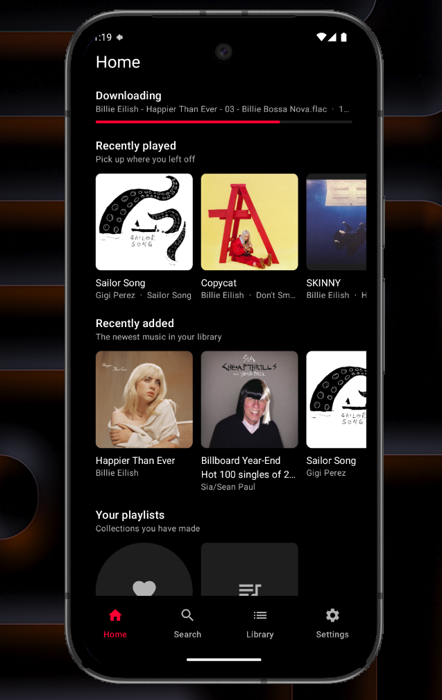
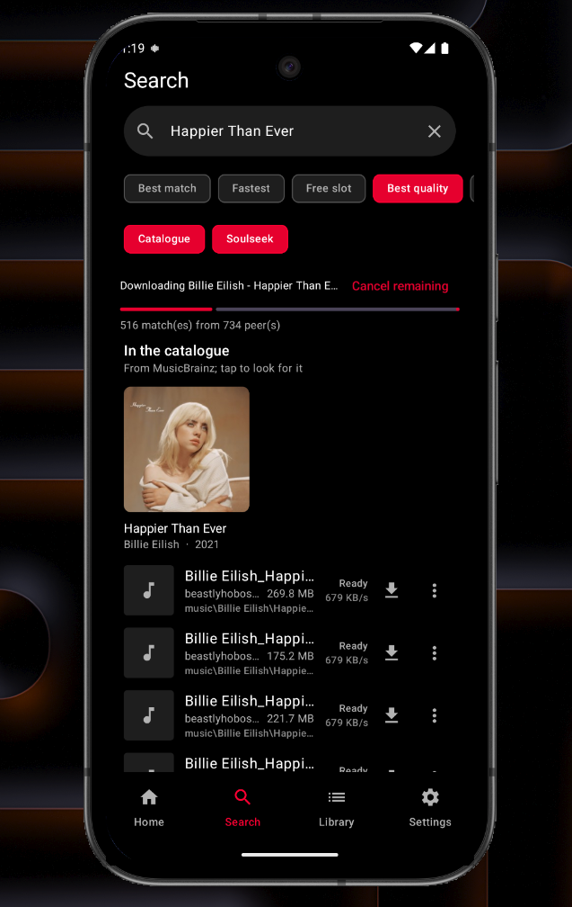
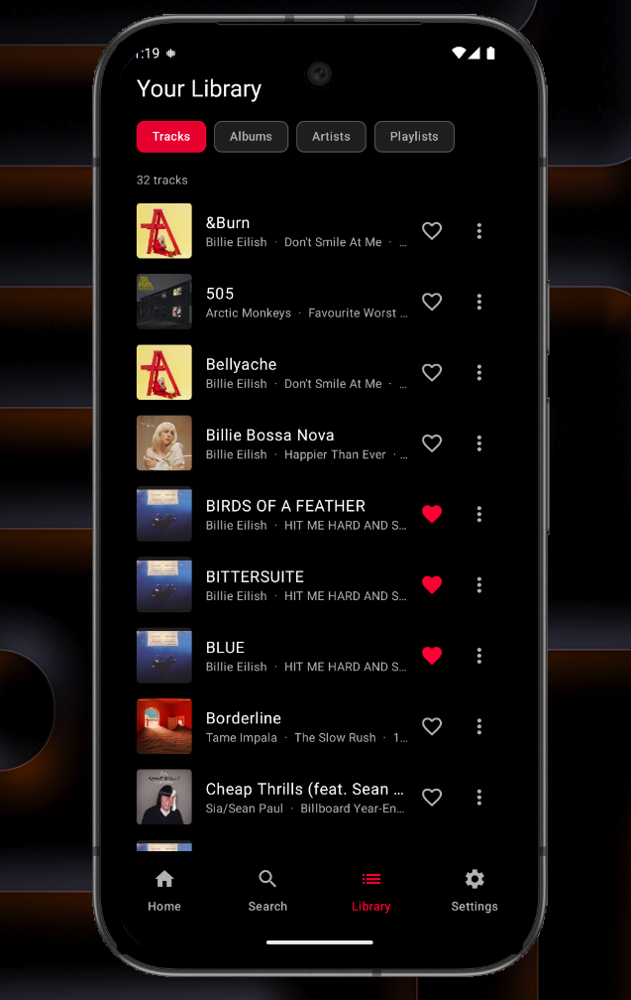
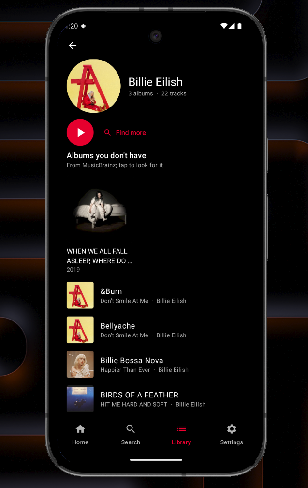
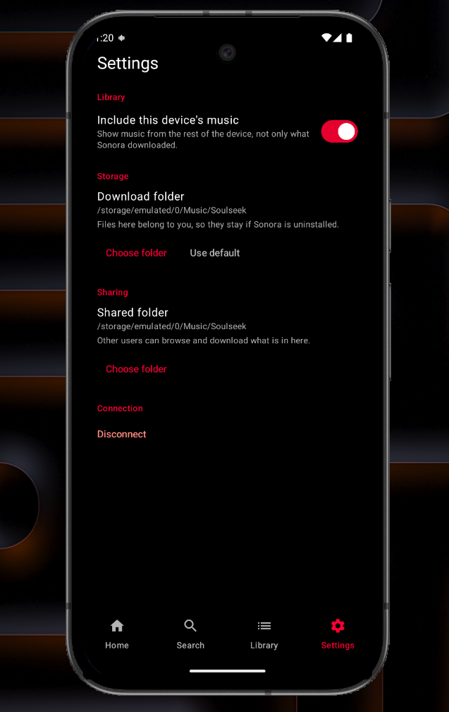

# Sonora

A native Android Soulseek client. Search the network, download what you find, build a library and
play it — with the P2P protocol speaking directly from the phone. No server, no VPS, no
self-hosting.

**[Download the latest release →](https://github.com/devansharora18/sonora/releases)**

| Home | Search | Library |
| :---: | :---: | :---: |
|  |  |  |

| Artist | Settings |
| :---: | :---: |
|  |  |

## Install

Download the APK from [Releases](https://github.com/devansharora18/sonora/releases) and open it on
your phone. Android will ask you to allow installing from that source the first time.

You need a Soulseek account. Sonora registers an unknown username on first sign-in, so pick your
own. Requires Android 8.0 (API 26) or newer.

## What it does

**The protocol runs on the device.** Sonora speaks Soulseek itself — login, search, peer
connections, transfers, uploads — in Kotlin, inside a foreground service. There is no relay and no
companion process; the app is the client.

**The filesystem is the library.** Downloads go to a folder you choose, so the files are yours and
survive uninstalling the app. Everything shown is derived from what is actually on disk, which is
why a file you delete disappears from the library.

**A catalogue alongside the network.** Soulseek can only be searched — it has no idea what an album
is. MusicBrainz does, so an artist's page can list what you do not have, and a search shows
catalogue matches above the peer results, with a toggle to look at either on its own.

- **Search** — relevance-ranked, with size, bitrate, peer and free-slot signals; sort by best
  match, fastest, free slot or quality.
- **Downloads** — a sequential queue with live progress, cancel-remaining, and a notification that
  says what is actually happening.
- **Library** — tracks, albums, artists and playlists, plus the music already on your device if
  you want it included.
- **Playback** — Media3, with a mini player, a full player, a queue, shuffle and repeat.
- **Liked songs** — a playlist like any other, so it sorts and plays the same way as the rest.
- **Recently played** — recorded from the player, so it counts what you listened to rather than
  what you tapped.
- **Resharing** — the folder you download to is shared back, with browsing and uploads working.
- **Saved login** — optional, and encrypted with a key held in the Android Keystore.

## Build

You need JDK 21 and the Android SDK with platform 37. Android Studio's bundled JDK is fine:

```bash
export JAVA_HOME="$HOME/development/android-studio/jbr"
./gradlew :app:assembleDebug        # debug APK
./gradlew :app:testDebugUnitTest    # unit tests — no device or emulator needed
./gradlew :app:assembleRelease      # release APK
```

A release build is signed from `keystore.properties` at the repository root, which is deliberately
not committed:

```properties
storeFile=sonora-release.jks
storePassword=…
keyAlias=sonora
keyPassword=…
```

Without that file the release build still runs and produces an unsigned APK. See
[toolchain](docs/toolchain.md) for the version pairing and the four traps that produced it.

## TODO

- **Stream undownloaded music straight from Soulseek.** Play a peer's file while it arrives,
  instead of waiting for the whole download before anything can be heard.
- **Player gestures.** Swiping on the mini player, and the gestures a full player is expected to
  have.

## Docs

- [Product requirements](docs/PRD.md) — scope, architecture, and the decisions behind them.
- [Protocol scope](docs/protocol-scope.md) — how much of Soulseek is implemented, and what is
  deliberately not.
- [Toolchain](docs/toolchain.md) — versions, and the traps that produced them.

## Known limitations

- **Distributed search is implemented but not adopted.** The app joins the tree as a leaf and
  serves uploads, but does not yet take part in distributed search — see
  [protocol scope](docs/protocol-scope.md).
- **Not on any store.** The APK is the distribution channel, so updates are manual.

## License

AGPL-3.0. See [LICENSE](LICENSE).

This is a file-sharing client, not a content host. You are responsible for what you download and
share.
